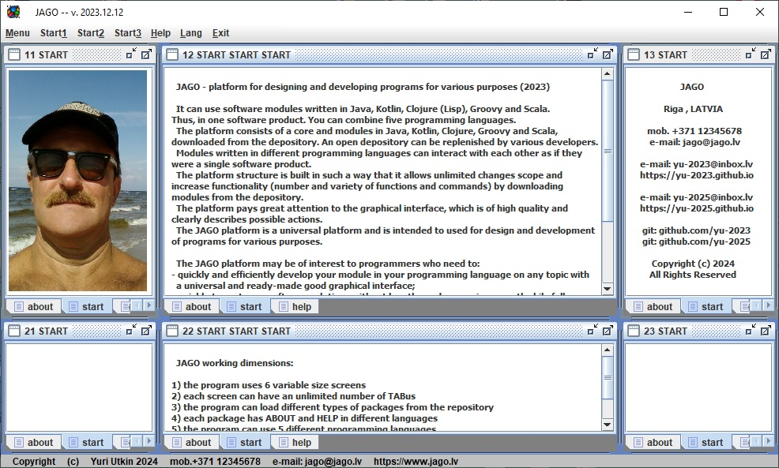
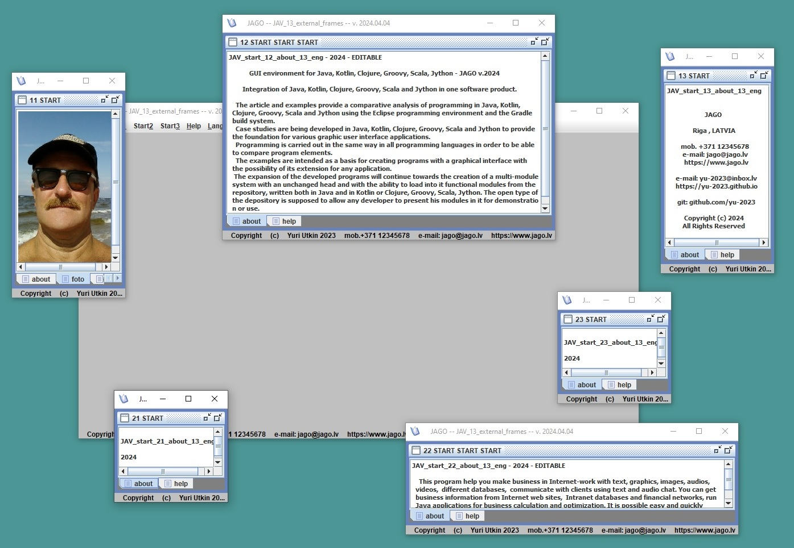
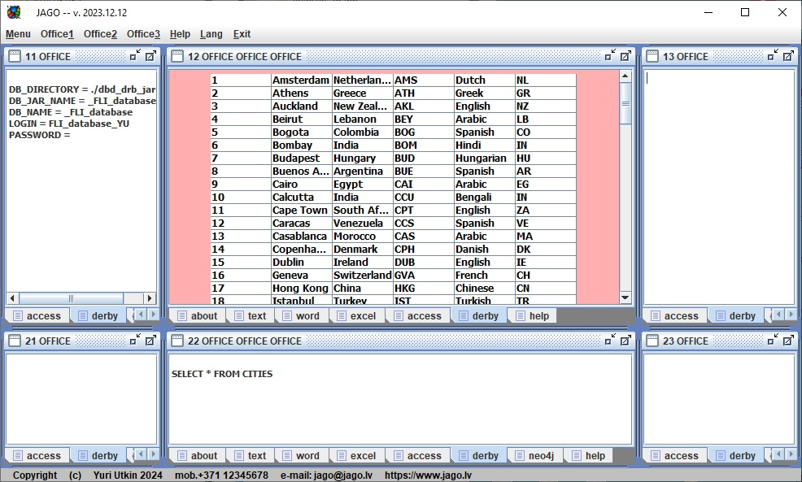

# JAGO - platform for designing and developing programs for various purposes (2023)

It can use software modules written in Java, Kotlin, Clojure (Lisp), Groovy and Scala.
Thus, in one software product you can combine six programming languages.

The platform consists of a core and modules in Java, Kotlin, Clojure, Groovy and Scala,
downloaded from the depository. An open depository can be replenished by various developers.

Modules written in different programming languages ​​can interact with each other as if they
were a single software product.

The platform structure is built in such a way that it allows unlimited changes scope and increase
functionality (number and variety of functions and commands) by downloading modules from
the depository.

The platform pays great attention to the graphical interface, which is of high quality and clearly
describes possible actions.

The JAGO platform is a universal platform and is intended to used for design and development
of programs for various purposes.

The JAGO platform may be of interest to programmers who need to:
- quickly and efficiently develop your module in your programming language on any topic with
  a universal and ready-made good graphical interface;
- quickly try out your software solutions without lengthy and expensive a worthwhile full
  development cycle;
- use a ready-made high-quality graphical interface for your developed programs;
- combine modules written in one software product without major rework in various
  programming languages;
- contain in one program a large number of different functions and commands, which do not
  fit into an ordinary graphical interface;
- use various depository blanks to speed up the solution of your tasks.

JAGO working dimensions:
- the program uses 6 variable size screens (JAGO_START_normal.jpg) (JAGO_START_external.jpg) (JAGO_DERBY_normal.jpg)
- each screen can have an unlimited number of TABs
- the program can load different types of packages from the depository
- each package has ABOUT and HELP in different languages
- the program can use 5 different programming languages
- the program uses automatic saving of data changes
- it is additionally possible to work with several subwindows within each TAB
- it is additionally possible to load several packages into the program at the same time

<html>
  <body>
  
  <head>
 </head>
  
<table border="0">
  <tr>
    <td></td>
  </tr>
</table>

<table border="0">
  <tr>
    <td></td>
  </tr>
</table>

<table border="0">
  <tr>
    <td></td>
  </tr>
</table>

  </body>
  
</html>
